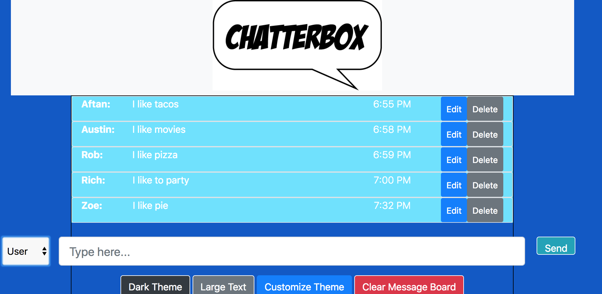
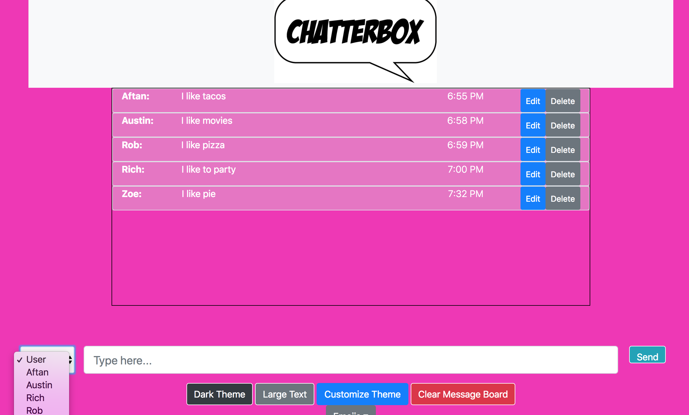

# ChatterBox
Welcome to Chatterbox! Chatterbox is a messenger program that allows its users to do the following:
- type and send messages
- change the available user (person typing the message)
- toggle between dark theme mode and the default theme
- switch between a list of custom themes
- edit and delete messages
- clear the entire message board
- toggle between large text and regular default text


## Screenshots






## How to run this project


* Use npm to instal http-server : 
``` 
npm install -g http-server

````
* Run the server

``` sh
hs  -p 9999
```
* Open Chrome and navaigate to: 
```
localhost: 8080
```http://127.0.0.1:8080/
``` js

